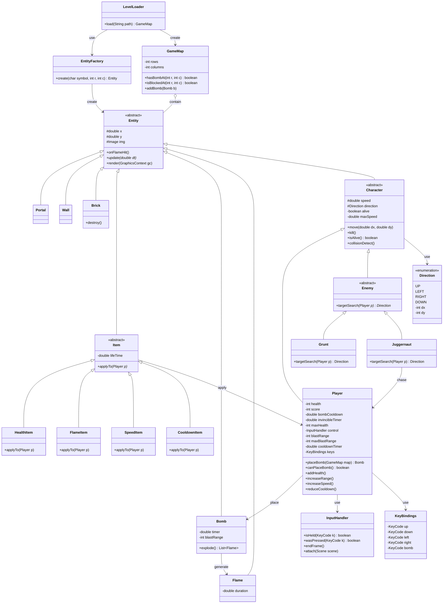

# Bomberman - Class Diagram

```mermaid
classDiagram
direction TB

class LevelLoader {
  +load(String path) GameMap
}
class EntityFactory {
  +create(char symbol, int r, int c) Entity
}
class GameMap {
  -int rows
  -int columns
  +hasBombAt(int r, int c) boolean
  +isBlockedAt(int r, int c) boolean
  +addBomb(Bomb b)
}

class Entity {
  <<abstract>>
  #double x
  #double y
  #Image img
  +onFlameHit()
  +update(double dt)*
  +render(GraphicsContext gc)
}
class Portal
class Wall
class Brick {
  +destroy()
}
class Bomb {
  -double timer
  -int blastRange
  +explode() List~Flame~
}
class Flame {
  -double duration
}

class Item {
  <<abstract>>
  -double lifeTime
  +applyTo(Player p)*
}
class HealthItem {
  +applyTo(Player p)
}
class FlameItem {
  +applyTo(Player p)
}
class SpeedItem {
  +applyTo(Player p)
}
class CooldownItem {
  +applyTo(Player p)
}

class Character {
  <<abstract>>
  #double speed
  #Direction direction
  -boolean alive
  -double maxSpeed
  +move(double dx, double dy)
  +kill()
  +isAlive() boolean
  +collisionDetect()
}
class Player {
  -int health
  -int score
  -double bombCooldown
  -double invincibleTimer
  -int maxHealth
  -InputHandler control
  -int blastRange
  -int maxBlastRange
  -double cooldownTimer
  -KeyBindings keys
  +placeBomb(GameMap map) Bomb
  +canPlaceBomb() boolean
  +addHealth()
  +increaseRange()
  +increaseSpeed()
  +reduceCooldown()
}
class Enemy {
  <<abstract>>
  +targetSearch(Player p) Direction*
}
class Grunt {
  +targetSearch(Player p) Direction
}
class Juggernaut {
  +targetSearch(Player p) Direction
}

class Direction {
  <<enumeration>>
  UP
  LEFT
  RIGHT
  DOWN
  -int dx
  -int dy
}
class InputHandler {
  +isHeld(KeyCode k) boolean
  +wasPressed(KeyCode k) boolean
  +endFrame()
  +attach(Scene scene)
}
class KeyBindings {
  -KeyCode up
  -KeyCode down
  -KeyCode left
  -KeyCode right
  -KeyCode bomb
}

Entity <|-- Portal
Entity <|-- Wall
Entity <|-- Brick
Entity <|-- Item
Entity <|-- Bomb
Entity <|-- Flame
Entity <|-- Character
Item <|-- HealthItem
Item <|-- FlameItem
Item <|-- SpeedItem
Item <|-- CooldownItem
Character <|-- Player
Character <|-- Enemy
Enemy <|-- Grunt
Enemy <|-- Juggernaut

LevelLoader --> EntityFactory : use
LevelLoader --> GameMap : create
EntityFactory --> Entity : create
GameMap o-- Entity : contain
Player --> Bomb : place
Bomb --> Flame : generate
Item --> Player : apply
Juggernaut --> Player : chase
Character --> Direction : use
Player --> InputHandler : use
Player --> KeyBindings : use
```
