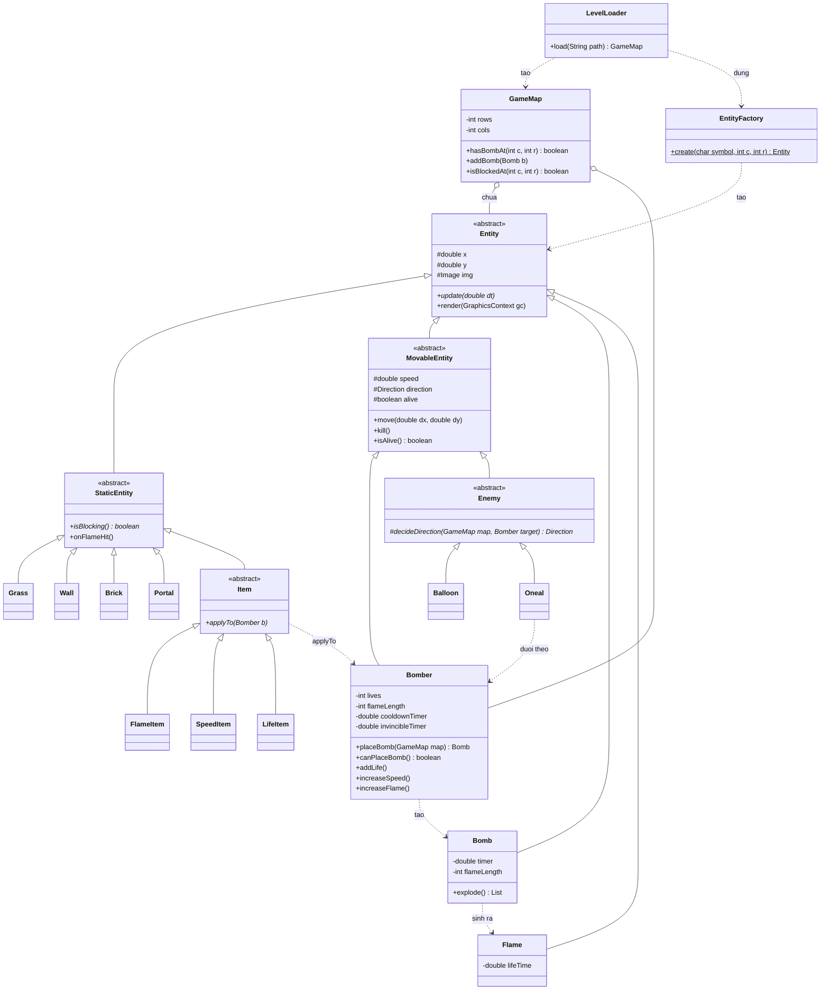

# Bomberman - Class Diagram

```mermaid
classDiagram
direction TB

class Entity {
  <<abstract>>
  #double x
  #double y
  #Image img
  +update(double dt)*
  +render(GraphicsContext gc)
}
class StaticEntity {
  <<abstract>>
  +isBlocking() boolean*
  +onFlameHit()
}
class MovableEntity {
  <<abstract>>
  #double speed
  #Direction direction
  #boolean alive
  +move(double dx, double dy)
  +kill()
  +isAlive() boolean
}
class Item {
  <<abstract>>
  +applyTo(Bomber b)*
}
class Grass
class Wall
class Brick
class Portal
class FlameItem
class SpeedItem
class LifeItem
class Bomb {
  -double timer
  -int flameLength
  +explode() List
}
class Flame {
  -double lifeTime
}
class Bomber {
  -int lives
  -int flameLength
  -double cooldownTimer
  -double invincibleTimer
  +placeBomb(GameMap map) Bomb
  +canPlaceBomb() boolean
  +addLife()
  +increaseSpeed()
  +increaseFlame()
}
class Enemy {
  <<abstract>>
  #decideDirection(GameMap map, Bomber target) Direction*
}
class Balloon
class Oneal
class GameMap {
  -int rows
  -int cols
  +hasBombAt(int c, int r) boolean
  +addBomb(Bomb b)
  +isBlockedAt(int c, int r) boolean
}
class EntityFactory {
  +create(char symbol, int c, int r) Entity$
}
class LevelLoader {
  +load(String path) GameMap
}

Entity <|-- StaticEntity
Entity <|-- MovableEntity
Entity <|-- Bomb
Entity <|-- Flame
StaticEntity <|-- Grass
StaticEntity <|-- Wall
StaticEntity <|-- Brick
StaticEntity <|-- Portal
StaticEntity <|-- Item
Item <|-- FlameItem
Item <|-- SpeedItem
Item <|-- LifeItem
MovableEntity <|-- Bomber
MovableEntity <|-- Enemy
Enemy <|-- Balloon
Enemy <|-- Oneal

GameMap o-- Entity : chua
GameMap o-- Bomber
Bomber ..> Bomb : tao
Bomb ..> Flame : sinh ra
Item ..> Bomber : applyTo
Oneal ..> Bomber : duoi theo
LevelLoader ..> GameMap : tao
LevelLoader ..> EntityFactory : dung
EntityFactory ..> Entity : tao
```
